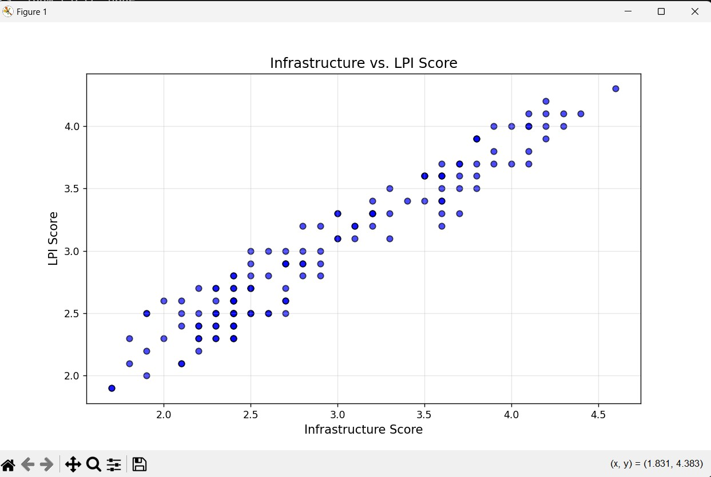

# Supply Chain Tracking Data Analysis - The World Bank

**Overview**

This project leverages data analytics to improve supply chain efficiency using the World Bank's Logistics Performance Index (LPI) dataset. The analysis identifies key relationships between logistics indicators, such as infrastructure and overall logistics performance, and provides insights into global supply chain optimization.

**Objectives**

Analyze the relationship between infrastructure quality and overall logistics performance.
Apply clustering techniques to group countries based on logistics performance metrics.
Develop actionable insights for improving supply chain efficiency globally.

**Dataset**

Source: [World Bank Logistics Performance Index](https://lpi.worldbank.org/international/tracking-data)

**Key Columns:**
Economy: Country names.
LPI Score: Overall logistics performance index.
Infrastructure Score: Measures the quality of transport infrastructure.
Customs Score: Efficiency of the clearance process.
Timeliness Score: Timeliness of shipments in reaching their destination.

**Technologies and Tools**

Programming Language: Python

Libraries:

pandas: Data manipulation and cleaning.

matplotlib: Data visualization.

scikit-learn: Clustering analysis (K-Means).

Git: Version control for project management.

**Key Features**

**1. Data Cleaning and Preparation**
Filled missing values for numeric columns with the mean of each column.
Renamed columns for improved readability (e.g., LPI Score → LPI_Score).

**2. Exploratory Data Analysis (EDA)**
Created scatter plots to visualize the relationship between logistics performance metrics.
Calculated the correlation between Infrastructure Score and LPI Score, revealing a strong positive relationship.

**3. Clustering Analysis**
Applied K-Means clustering to group countries into clusters based on their logistics performance metrics.
Visualized clusters to identify high-performing, average, and low-performing countries.

**4. Results and Visualizations**
Enhanced scatter plots with color coding, grid lines, and transparency for better insights.
Clustering visualizations that categorize countries by performance groups.

# Basic Data Visualization

# Enhanced Data Visualization

